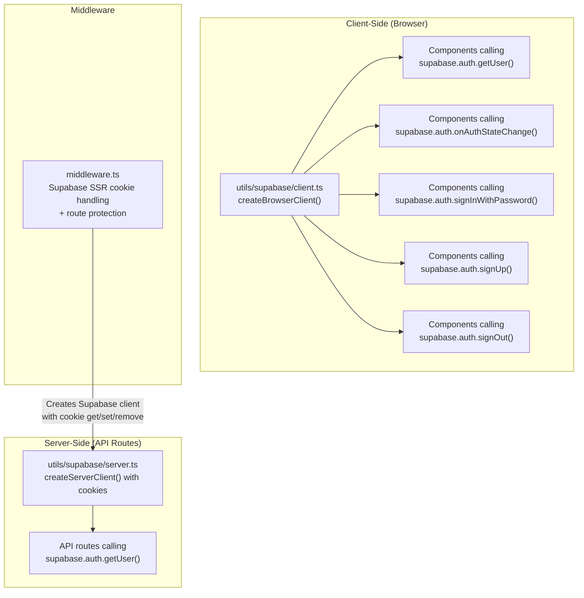

# SeekEatz: Supabase Auth → Clerk Migration Guide

---

## Part 1: Current Authentication System Audit

### Overview

The app uses **Supabase Auth** (email/password only) via the `@supabase/ssr` package. There is **no OAuth, no social login, no magic links, and no password reset** implemented. Auth is deeply integrated across **16 source files** with **43+ direct `supabase.auth.*` call sites**.

> [!IMPORTANT]
> Clerk env vars are already present in [.env.local](file:///Users/swapnildatta/Documents/SeekEatz/SeekEatz/.env.local) (`NEXT_PUBLIC_CLERK_PUBLISHABLE_KEY`, `CLERK_SECRET_KEY`), but no Clerk SDK is installed and no Clerk code exists yet.

### Architecture Diagram



### Auth Methods Used

| Method | Files | Description |
|--------|-------|-------------|
| `signInWithPassword()` | [auth/signin/page.tsx](file:///Users/swapnildatta/Documents/SeekEatz/SeekEatz/app/auth/signin/page.tsx), [AuthScreen.tsx](file:///Users/swapnildatta/Documents/SeekEatz/SeekEatz/app/components/AuthScreen.tsx) | Email + password login |
| `signUp()` | [auth/signup/page.tsx](file:///Users/swapnildatta/Documents/SeekEatz/SeekEatz/app/auth/signup/page.tsx) | Email + password registration |
| `signOut()` | [useSessionActivity.ts](file:///Users/swapnildatta/Documents/SeekEatz/SeekEatz/app/hooks/useSessionActivity.ts), [Settings.tsx](file:///Users/swapnildatta/Documents/SeekEatz/SeekEatz/app/components/Settings.tsx) | Logout |
| [getUser()](file:///Users/swapnildatta/Documents/SeekEatz/SeekEatz/lib/distance-utils.ts#69-100) | 14 files, 28 call sites | Check current user (client + server) |
| `onAuthStateChange()` | [signin/page.tsx](file:///Users/swapnildatta/Documents/SeekEatz/SeekEatz/app/auth/signin/page.tsx), [MainApp.tsx](file:///Users/swapnildatta/Documents/SeekEatz/SeekEatz/app/components/MainApp.tsx), [AIChat.tsx](file:///Users/swapnildatta/Documents/SeekEatz/SeekEatz/app/components/AIChat.tsx), [AuthStateManager.tsx](file:///Users/swapnildatta/Documents/SeekEatz/SeekEatz/app/components/AuthStateManager.tsx) | Listen for auth events |

### Supabase Client Creation Patterns

| Pattern | File | Context |
|---------|------|---------|
| Browser client | [client.ts](file:///Users/swapnildatta/Documents/SeekEatz/SeekEatz/utils/supabase/client.ts) | `createBrowserClient(url, anonKey)` — used by all client components |
| Server client | [server.ts](file:///Users/swapnildatta/Documents/SeekEatz/SeekEatz/utils/supabase/server.ts) | `createServerClient(url, anonKey, { cookies })` — used by API routes |
| Middleware client | [middleware.ts](file:///Users/swapnildatta/Documents/SeekEatz/SeekEatz/middleware.ts) | Inline `createServerClient()` with manual cookie get/set/remove |
| Module-level client | [usage-cookie.ts](file:///Users/swapnildatta/Documents/SeekEatz/SeekEatz/lib/usage-cookie.ts) | [createClient(url, serviceRoleKey)](file:///Users/swapnildatta/Documents/SeekEatz/SeekEatz/utils/supabase/client.ts#3-9) — admin client, no auth |

### Complete File-by-File Breakdown

#### 🔴 Auth Pages (Custom UI — will be replaced by Clerk components)

| File | Auth Calls | What it Does |
|------|-----------|--------------|
| [auth/signin/page.tsx](file:///Users/swapnildatta/Documents/SeekEatz/SeekEatz/app/auth/signin/page.tsx) (287 lines) | `signInWithPassword`, [getUser](file:///Users/swapnildatta/Documents/SeekEatz/SeekEatz/lib/distance-utils.ts#69-100), `onAuthStateChange` | Custom sign-in form. Post-login: upserts `profiles` row, claims anonymous data, clears guest session, sets localStorage flags, redirects to `/chat`. |
| [auth/signup/page.tsx](file:///Users/swapnildatta/Documents/SeekEatz/SeekEatz/app/auth/signup/page.tsx) (529 lines) | `signUp`, [getUser](file:///Users/swapnildatta/Documents/SeekEatz/SeekEatz/lib/distance-utils.ts#69-100) | Custom sign-up form. Post-signup: migrates guest chat messages to Supabase, creates/upserts profile row, handles "from chat gate" flow (skip onboarding), claims anon data, redirects to `/onboarding` or `/chat`. |
| [AuthScreen.tsx](file:///Users/swapnildatta/Documents/SeekEatz/SeekEatz/app/components/AuthScreen.tsx) (155 lines) | `signInWithPassword` | Duplicate sign-in component (dark theme). Used as inline auth within other components. |

#### 🟡 Auth Infrastructure

| File | Auth Calls | What it Does |
|------|-----------|--------------|
| [middleware.ts](file:///Users/swapnildatta/Documents/SeekEatz/SeekEatz/middleware.ts) (111 lines) | [getUser](file:///Users/swapnildatta/Documents/SeekEatz/SeekEatz/lib/distance-utils.ts#69-100) | Creates Supabase SSR client with cookie handling. Bypasses API routes. Redirects logged-in users from `/auth/*` to `/chat`. Protects `/home`, `/favorites`, `/settings`. |
| [AuthStateManager.tsx](file:///Users/swapnildatta/Documents/SeekEatz/SeekEatz/app/components/AuthStateManager.tsx) (85 lines) | `getUser`, `onAuthStateChange` | Wraps app. Detects user switches and logouts. Clears per-user data (chat, sessionStorage, localStorage) on account change. |
| [auth-utils.ts](file:///Users/swapnildatta/Documents/SeekEatz/SeekEatz/lib/auth-utils.ts) (169 lines) | `getUser` (5 call sites) | Helper functions: `isAuthenticated()`, `getCurrentUser()`, `hasCompletedOnboarding()`, `getLastLogin()`, `updateLastLogin()`, `setOnboardingComplete()`. |
| [useSessionActivity.ts](file:///Users/swapnildatta/Documents/SeekEatz/SeekEatz/app/hooks/useSessionActivity.ts) (127 lines) | `signOut` | 30-minute inactivity timeout. Calls `supabase.auth.signOut()` on timeout. |
| [guest-session.ts](file:///Users/swapnildatta/Documents/SeekEatz/SeekEatz/lib/guest-session.ts) (278 lines) | None directly | Manages pre-auth guest data in sessionStorage. Data is migrated to Supabase on signup. |

#### 🟢 Components That Check Auth State

| File | Auth Calls | Purpose |
|------|-----------|---------|
| [MainApp.tsx](file:///Users/swapnildatta/Documents/SeekEatz/SeekEatz/app/components/MainApp.tsx) | `getUser`, `onAuthStateChange` | Main app shell. Checks auth to show/hide features, load profile. |
| [AIChat.tsx](file:///Users/swapnildatta/Documents/SeekEatz/SeekEatz/app/components/AIChat.tsx) | `getUser`, `onAuthStateChange` | Chat component. Checks auth for session management and user context. |
| [Settings.tsx](file:///Users/swapnildatta/Documents/SeekEatz/SeekEatz/app/components/Settings.tsx) | `getUser` (6 sites), `signOut` | Profile management, account deletion, logout. |
| [OnboardingFlow.tsx](file:///Users/swapnildatta/Documents/SeekEatz/SeekEatz/app/components/OnboardingFlow.tsx) | `getUser` | Fetches user ID to save profile to Supabase. |
| [page.tsx (root)](file:///Users/swapnildatta/Documents/SeekEatz/SeekEatz/app/page.tsx) | `getUser` | Root landing page. Redirects authenticated users to `/chat`. |
| [onboarding/page.tsx](file:///Users/swapnildatta/Documents/SeekEatz/SeekEatz/app/onboarding/page.tsx) | `getUser` | Onboarding page. |
| [settings/account/page.tsx](file:///Users/swapnildatta/Documents/SeekEatz/SeekEatz/app/settings/account/page.tsx) | `getUser` | Account settings. |
| [ThemeContext.tsx](file:///Users/swapnildatta/Documents/SeekEatz/SeekEatz/app/contexts/ThemeContext.tsx) | `getUser` | Loads user-specific theme preferences. |
| [NutritionContext.tsx](file:///Users/swapnildatta/Documents/SeekEatz/SeekEatz/app/contexts/NutritionContext.tsx) | `getUser` | Loads user-specific nutrition targets. |

#### 🔵 API Routes That Check Auth

| File | Auth Calls | Purpose |
|------|-----------|---------|
| [api/chat/route.ts](file:///Users/swapnildatta/Documents/SeekEatz/SeekEatz/app/api/chat/route.ts) | `getUser` | Checks if user is authenticated for usage tracking (anon users get limited uses). |
| [api/search/route.ts](file:///Users/swapnildatta/Documents/SeekEatz/SeekEatz/app/api/search/route.ts) | `getUser` | Same — usage gating for anonymous users. |
| [api/claim-anon-data/route.ts](file:///Users/swapnildatta/Documents/SeekEatz/SeekEatz/app/api/claim-anon-data/route.ts) | `getUser` | Requires authenticated session. Claims guest data for the user. |

### What Does NOT Exist (Important for Clerk Migration)

| Missing Item | Relevance |
|-------------|-----------|
| **No catch-all route** `app/[[...rest]]/page.tsx` | Clerk requires this for its sign-in/sign-up modals |
| **No auth callback route** `app/auth/callback/route.ts` | Supabase OAuth would need this, but wasn't implemented. Clerk doesn't need it. |
| **No OAuth/social login** | No Google, GitHub, etc. Clerk can easily add these. |
| **No password reset flow** | `resetPasswordForEmail()` is never called. Clerk provides this out of the box. |
| **No email verification** | No confirmation flow exists. Clerk handles this automatically. |
| **No `ClerkProvider`** | Not installed yet. Must wrap the entire app in `layout.tsx`. |

---

## Part 2: Systematic Clerk Migration Plan

### Phase 0: Install Dependencies

```bash
npm install @clerk/nextjs
npm uninstall @supabase/ssr  # After migration is complete
```

### Phase 1: Core Infrastructure (4 files)

#### 1.1 [MODIFY] [layout.tsx](file:///Users/swapnildatta/Documents/SeekEatz/SeekEatz/app/layout.tsx)

**What to change:** Wrap the entire app with `<ClerkProvider>`.

```diff
+import { ClerkProvider } from '@clerk/nextjs';

 export default function RootLayout({ children }) {
   return (
     <html lang="en" suppressHydrationWarning>
       <body className={`${inter.className} bg-slate-100`}>
-        <ThemeProvider>
+        <ClerkProvider>
+          <ThemeProvider>
             <NutritionProvider>
               <ChatProvider>
                 <DevHelpers />
                 <AppContainer>{children}</AppContainer>
               </ChatProvider>
             </NutritionProvider>
-        </ThemeProvider>
+          </ThemeProvider>
+        </ClerkProvider>
       </body>
     </html>
   );
 }
```

#### 1.2 [REPLACE] [middleware.ts](file:///Users/swapnildatta/Documents/SeekEatz/SeekEatz/middleware.ts)

**What to change:** Replace entire Supabase SSR middleware with Clerk's `clerkMiddleware`.

```typescript
import { clerkMiddleware, createRouteMatcher } from '@clerk/nextjs/server';

// Public routes that don't require authentication
const isPublicRoute = createRouteMatcher([
  '/',
  '/get-started',
  '/chat',
  '/waitlist(.*)',
  '/auth/signin(.*)',
  '/auth/signup(.*)',
  '/onboarding',
  '/api/search(.*)',   // Public search API
  '/api/chat(.*)',     // Public chat API (has its own usage gating)
  '/api/telemetry(.*)',
  '/api/waitlist(.*)',
  '/legal(.*)',
  '/help(.*)',
  '/guidelines(.*)',
]);

export default clerkMiddleware(async (auth, request) => {
  if (!isPublicRoute(request)) {
    await auth.protect();
  }
});

export const config = {
  matcher: [
    '/((?!_next/static|_next/image|favicon.ico|logos|.*\\.(?:svg|png|jpg|jpeg|gif|webp)$).*)',
  ],
};
```

#### 1.3 [NEW] `app/[[...rest]]/page.tsx` — Catch-All Route

> [!CAUTION]
> This file is **required** by Clerk. Without it, Clerk's modal-based sign-in/sign-up will not work, and you'll get 404s for Clerk's internal routes.

```typescript
// This catch-all route is required by Clerk for its modal-based auth flows
// It should not render anything — Clerk handles the UI
export default function CatchAllPage() {
  return null;
}
```

> [!WARNING]
> Make sure this catch-all does **not** conflict with your existing named routes (`/chat`, `/home`, `/settings`, etc.). Next.js gives priority to named routes over catch-all routes, so existing routes will still work. However, test thoroughly.

#### 1.4 [MODIFY] [utils/supabase/server.ts](file:///Users/swapnildatta/Documents/SeekEatz/SeekEatz/utils/supabase/server.ts)

**What to change:** Remove auth-related cookie handling. Supabase server client is still needed for **data queries** (menu_items, profiles, etc.), but should no longer handle auth cookies. Use Clerk's `auth()` for user identity.

```typescript
import { createClient as createSupabaseClient } from '@supabase/supabase-js';

export async function createClient() {
  return createSupabaseClient(
    process.env.NEXT_PUBLIC_SUPABASE_URL!,
    process.env.NEXT_PUBLIC_SUPABASE_ANON_KEY!
  );
}
```

#### 1.5 [MODIFY] [utils/supabase/client.ts](file:///Users/swapnildatta/Documents/SeekEatz/SeekEatz/utils/supabase/client.ts)

**What to change:** Switch from `createBrowserClient` (auth-aware) to plain `createClient` (data-only).

```typescript
import { createClient as createSupabaseClient } from '@supabase/supabase-js';

export function createClient() {
  return createSupabaseClient(
    process.env.NEXT_PUBLIC_SUPABASE_URL!,
    process.env.NEXT_PUBLIC_SUPABASE_ANON_KEY!
  );
}
```

### Phase 2: Replace Auth Pages (3 files)

#### 2.1 [REPLACE] [auth/signin/page.tsx](file:///Users/swapnildatta/Documents/SeekEatz/SeekEatz/app/auth/signin/page.tsx)

Replace the 287-line custom form with Clerk's `<SignIn />` component:

```typescript
import { SignIn } from '@clerk/nextjs';

export default function SignInPage() {
  return (
    <div className="min-h-screen bg-white flex items-center justify-center p-6">
      <SignIn
        appearance={{
          elements: {
            formButtonPrimary: 'bg-gradient-to-r from-cyan-500 to-blue-600 hover:from-cyan-600 hover:to-blue-700',
            card: 'shadow-none',
          }
        }}
        afterSignInUrl="/chat"
        signUpUrl="/auth/signup"
      />
    </div>
  );
}
```

> [!IMPORTANT]
> The current `signin/page.tsx` does significant post-login work: profile upserts, guest data claiming, localStorage flag setting. This logic must be moved to a **Clerk webhook** or a **post-auth API route** that runs after sign-in. See Phase 4.

#### 2.2 [REPLACE] [auth/signup/page.tsx](file:///Users/swapnildatta/Documents/SeekEatz/SeekEatz/app/auth/signup/page.tsx)

Replace 529-line custom form with Clerk's `<SignUp />`:

```typescript
import { SignUp } from '@clerk/nextjs';

export default function SignUpPage() {
  return (
    <div className="min-h-screen bg-white flex items-center justify-center p-6">
      <SignUp
        appearance={{
          elements: {
            formButtonPrimary: 'bg-gradient-to-r from-cyan-500 to-blue-600 hover:from-cyan-600 hover:to-blue-700',
            card: 'shadow-none',
          }
        }}
        afterSignUpUrl="/onboarding"
        signInUrl="/auth/signin"
      />
    </div>
  );
}
```

#### 2.3 [DELETE] [AuthScreen.tsx](file:///Users/swapnildatta/Documents/SeekEatz/SeekEatz/app/components/AuthScreen.tsx)

Duplicate sign-in component. Replace any imports with Clerk's `<SignIn />` or redirect to `/auth/signin`.

### Phase 3: Replace Auth Checks in Components (10+ files)

Every `supabase.auth.getUser()` call needs to be replaced with the appropriate Clerk equivalent:

| Context | Supabase | Clerk Replacement |
|---------|----------|-------------------|
| Client components | `supabase.auth.getUser()` | `useUser()` hook from `@clerk/nextjs` |
| Server components | `supabase.auth.getUser()` | `auth()` from `@clerk/nextjs/server` |
| API routes | `supabase.auth.getUser()` | `auth()` from `@clerk/nextjs/server` |
| Auth state listener | `supabase.auth.onAuthStateChange()` | `useUser()` + `useEffect()` (reactive) |
| Sign out | `supabase.auth.signOut()` | `useClerk().signOut()` or `<SignOutButton />` |

#### File-by-file replacement map:

| File | Replace | With |
|------|---------|------|
| `MainApp.tsx` | `supabase.auth.getUser()` + `onAuthStateChange()` | `useUser()` — reactive, no listener needed |
| `AIChat.tsx` | `supabase.auth.getUser()` + `onAuthStateChange()` | `useUser()` |
| `Settings.tsx` | `supabase.auth.getUser()` (6 sites) + `signOut()` | `useUser()` + `useClerk().signOut()` |
| `OnboardingFlow.tsx` | `supabase.auth.getUser()` | `useUser()` |
| `page.tsx` (root) | `supabase.auth.getUser()` | `useUser()` |
| `onboarding/page.tsx` | `supabase.auth.getUser()` | `useUser()` |
| `settings/account/page.tsx` | `supabase.auth.getUser()` | `useUser()` |
| `ThemeContext.tsx` | `supabase.auth.getUser()` | `useUser()` |
| `NutritionContext.tsx` | `supabase.auth.getUser()` | `useUser()` |
| `AuthStateManager.tsx` | `getUser()` + `onAuthStateChange()` | `useUser()` + `useEffect()` |
| `useSessionActivity.ts` | `supabase.auth.signOut()` | `useClerk().signOut()` |

#### Key difference: User ID mapping (using Clerk `externalId`)

Clerk user IDs (`user_2abc...`) differ from Supabase UUIDs. To **keep all existing database data and code unchanged**, we use Clerk's `externalId` feature to store the Supabase-style UUID on each Clerk user. This way, every component and API that queries `profiles.id` continues using the same UUID format.

| Property | Supabase (before) | Clerk (after) | How to access |
|----------|-----------|---------------|---------------|
| User ID (for DB) | `user.id` (UUID) | `user.externalId` (UUID) | `user.externalId` in client, `auth().externalId` in server |
| Clerk-native ID | N/A | `user.id` (`user_2abc...`) | Only for Clerk API calls, NOT for DB queries |
| Email | `user.email` | `user.primaryEmailAddress?.emailAddress` | |

> [!IMPORTANT]
> **Strategy: Use `externalId` everywhere for database operations.**
> - When creating a new Clerk user (webhook `user.created`), generate a UUID and set it as the user's `externalId` via the Clerk Backend API.
> - All existing code that does `.eq('id', userId)` on the `profiles` table continues to work — just pass `user.externalId` instead of `user.id`.
> - The `profiles.id` column stays as UUID. No schema changes needed.

**Client-side pattern (updated for externalId):**
```typescript
// AFTER (Clerk with externalId)
import { useUser } from '@clerk/nextjs';
const { user } = useUser();
const userId = user?.externalId;  // UUID, same format as old Supabase user.id
const email = user?.primaryEmailAddress?.emailAddress;
```

**Server-side pattern (updated for externalId):**
```typescript
// AFTER (Clerk with externalId)
import { auth } from '@clerk/nextjs/server';
const { userId: clerkId, sessionClaims } = await auth();
// For DB operations, use externalId from session claims:
const userId = sessionClaims?.externalId as string | undefined;
// Or fetch from Clerk API if needed:
// const user = await clerkClient.users.getUser(clerkId);
// const userId = user.externalId;
```

### Phase 4: Move Post-Auth Logic (Critical)

The current `signin/page.tsx` and `signup/page.tsx` do significant work **after** successful auth:

1. Upsert `profiles` row with `last_login`, `email`, etc.
2. Claim anonymous data (`claimAnonymousData()`)
3. Migrate guest chat messages to Supabase
4. Clear guest session (`clearGuestSessionFull()`)
5. Set ~10 localStorage flags

**This logic must move to one of:**

| Option | Mechanism | Best For |
|--------|-----------|----------|
| **Clerk Webhook** | POST to `/api/webhooks/clerk` on `user.created`, `session.created` | Server-side profile creation, data claiming |
| **Post-auth component** | `useUser()` in a wrapper that runs once after auth | Client-side localStorage cleanup, guest session clearing |

**Recommended approach:** Create both:

```
[NEW] app/api/webhooks/clerk/route.ts   — handles profile creation on user.created
[NEW] app/components/PostAuthHandler.tsx — handles client-side cleanup on sign-in
```

### Phase 5: Update API Routes (3 files)

| File | Change |
|------|--------|
| `api/chat/route.ts` | Replace `supabase.auth.getUser()` with `auth()` from `@clerk/nextjs/server` |
| `api/search/route.ts` | Same |
| `api/claim-anon-data/route.ts` | Same |

Example:
```diff
-import { createClient } from '@/utils/supabase/server';
+import { auth } from '@clerk/nextjs/server';

 export async function POST(request: Request) {
-  const supabase = await createClient();
-  const { data: { user } } = await supabase.auth.getUser();
+  const { userId: clerkId, sessionClaims } = await auth();
+  const userId = (sessionClaims?.externalId as string) || null;
+  // userId is null for anonymous users, UUID for authenticated
```

### Phase 6: Update Helper Libraries (2 files)

| File | Change |
|------|--------|
| [auth-utils.ts](file:///Users/swapnildatta/Documents/SeekEatz/SeekEatz/lib/auth-utils.ts) | Rewrite all 5 functions to use Clerk instead of Supabase auth. Most can be simplified since Clerk handles session management. |
| [data-query-helpers.ts](file:///Users/swapnildatta/Documents/SeekEatz/SeekEatz/lib/data-query-helpers.ts) | Replace 4 `supabase.auth.getUser()` calls with Clerk's `auth()`. |

### Phase 7: Cleanup

| Action | Details |
|--------|---------|
| Remove `@supabase/ssr` | `npm uninstall @supabase/ssr` — no longer needed since Supabase is data-only |
| Delete dead files | `lib/usage-gate.ts`, `lib/freeUses.ts`, `lib/supabaseClient.ts`, `lib/supabase/browser.ts`, `lib/supabase/server.ts` |
| Update `.env.local` | Remove `NEXT_PUBLIC_SUPABASE_ANON_KEY` from auth context (keep for data), verify Clerk keys are correct |

### Migration Summary: All Files

| Action | File | Priority |
|--------|------|----------|
| **MODIFY** | `app/layout.tsx` | Phase 1 |
| **REPLACE** | `middleware.ts` | Phase 1 |
| **NEW** | `app/[[...rest]]/page.tsx` | Phase 1 |
| **MODIFY** | `utils/supabase/server.ts` | Phase 1 |
| **MODIFY** | `utils/supabase/client.ts` | Phase 1 |
| **REPLACE** | `app/auth/signin/page.tsx` | Phase 2 |
| **REPLACE** | `app/auth/signup/page.tsx` | Phase 2 |
| **DELETE** | `app/components/AuthScreen.tsx` | Phase 2 |
| **MODIFY** | `app/components/MainApp.tsx` | Phase 3 |
| **MODIFY** | `app/components/AIChat.tsx` | Phase 3 |
| **MODIFY** | `app/components/Settings.tsx` | Phase 3 |
| **MODIFY** | `app/components/OnboardingFlow.tsx` | Phase 3 |
| **MODIFY** | `app/page.tsx` | Phase 3 |
| **MODIFY** | `app/onboarding/page.tsx` | Phase 3 |
| **MODIFY** | `app/settings/account/page.tsx` | Phase 3 |
| **MODIFY** | `app/contexts/ThemeContext.tsx` | Phase 3 |
| **MODIFY** | `app/contexts/NutritionContext.tsx` | Phase 3 |
| **MODIFY** | `app/components/AuthStateManager.tsx` | Phase 3 |
| **MODIFY** | `app/hooks/useSessionActivity.ts` | Phase 3 |
| **NEW** | `app/api/webhooks/clerk/route.ts` | Phase 4 |
| **NEW** | `app/components/PostAuthHandler.tsx` | Phase 4 |
| **MODIFY** | `app/api/chat/route.ts` | Phase 5 |
| **MODIFY** | `app/api/search/route.ts` | Phase 5 |
| **MODIFY** | `app/api/claim-anon-data/route.ts` | Phase 5 |
| **MODIFY** | `lib/auth-utils.ts` | Phase 6 |
| **MODIFY** | `lib/data-query-helpers.ts` | Phase 6 |
| **DELETE** | Multiple dead files | Phase 7 |

---

## Part 3: AI Migration Prompt

Copy and paste the following prompt to another AI assistant to execute this migration:

---

### PROMPT START

```
You are migrating a Next.js 14+ App Router application called "SeekEatz" from Supabase Auth to Clerk authentication. The app uses TypeScript and Tailwind CSS.

## CURRENT STATE

The app currently uses Supabase Auth (`@supabase/ssr`) for email/password authentication only. No OAuth or social login exists. Auth is integrated across 16+ files with 43+ call sites.

**Key env vars already configured in .env.local:**
- NEXT_PUBLIC_CLERK_PUBLISHABLE_KEY (already set)
- CLERK_SECRET_KEY (already set)
- NEXT_PUBLIC_CLERK_SIGN_IN_URL=/auth/signin
- NEXT_PUBLIC_CLERK_SIGN_UP_URL=/auth/signup
- NEXT_PUBLIC_CLERK_AFTER_SIGN_IN_URL=/chat
- NEXT_PUBLIC_CLERK_AFTER_SIGN_UP_URL=/onboarding

**Important:** Supabase is still used for DATA (menu_items, profiles, restaurants, chat_sessions, etc.). Only the AUTH layer is being replaced. Keep `@supabase/supabase-js` installed for database queries.

## STEP 1: Install Clerk

Run: `npm install @clerk/nextjs`

## STEP 2: Core Infrastructure Changes

### 2a. Modify `app/layout.tsx`
- Import `ClerkProvider` from `@clerk/nextjs`
- Wrap the outermost content (inside `<body>`) with `<ClerkProvider>`
- Keep all existing providers (ThemeProvider, NutritionProvider, ChatProvider) inside ClerkProvider

### 2b. Replace `middleware.ts` entirely
- Remove all Supabase SSR code (createServerClient, cookie handling)
- Use `clerkMiddleware` from `@clerk/nextjs/server`
- Use `createRouteMatcher` to define public routes:
  - `/`, `/get-started`, `/chat`, `/waitlist(.*)`, `/auth/signin(.*)`, `/auth/signup(.*)`, `/onboarding`, `/api/search(.*)`, `/api/chat(.*)`, `/api/telemetry(.*)`, `/api/waitlist(.*)`, `/legal(.*)`, `/help(.*)`, `/guidelines(.*)`
- Protected routes (require auth): `/home`, `/favorites`, `/settings(.*)`
- Keep the existing matcher regex for static file exclusion

### 2c. Create `app/[[...rest]]/page.tsx`
- This catch-all route is REQUIRED by Clerk
- It should just return `null`
- CRITICAL: This MUST NOT conflict with existing named routes. Next.js prioritizes named routes, so existing `/chat`, `/home`, etc. will still work.

### 2d. Modify `utils/supabase/client.ts`
- Replace `createBrowserClient` from `@supabase/ssr` with `createClient` from `@supabase/supabase-js`
- Remove auth cookie handling — Supabase client is now data-only
- Keep the same function signature for backward compatibility

### 2e. Modify `utils/supabase/server.ts`
- Replace `createServerClient` from `@supabase/ssr` with `createClient` from `@supabase/supabase-js`
- Remove cookie handling — server client is now data-only
- Keep `async function createClient()` signature

## STEP 3: Replace Auth Pages

### 3a. Replace `app/auth/signin/page.tsx`
- Replace the entire 287-line custom form with Clerk's `<SignIn />` component
- Import `SignIn` from `@clerk/nextjs`
- Set `afterSignInUrl="/chat"` and `signUpUrl="/auth/signup"`
- Style with appearance prop to match the app's cyan/blue gradient theme

### 3b. Replace `app/auth/signup/page.tsx`
- Replace the entire 529-line custom form with Clerk's `<SignUp />` component
- Import `SignUp` from `@clerk/nextjs`
- Set `afterSignUpUrl="/onboarding"` and `signInUrl="/auth/signin"`
- IMPORTANT: The current signup page does extensive post-signup work (guest chat migration, profile creation, anonymous data claiming). This logic must be moved — see Step 5.

### 3c. Delete `app/components/AuthScreen.tsx`
- This is a duplicate sign-in component (dark themed)
- Remove all imports of `AuthScreen` from other files
- If any component uses `<AuthScreen onSuccess={...} />`, replace with a redirect to `/auth/signin`

## STEP 4: Replace Auth Calls in Components

For EVERY file listed below, make these replacements:

**Client-side pattern:**
```typescript
// BEFORE (Supabase)
import { createClient } from '@/utils/supabase/client';
const supabase = createClient();
const { data: { user } } = await supabase.auth.getUser();
const userId = user?.id;
const email = user?.email;

// AFTER (Clerk — use externalId for DB operations)
import { useUser } from '@clerk/nextjs';
const { user, isLoaded, isSignedIn } = useUser();
const userId = user?.externalId;  // UUID, same format as old Supabase user.id
const email = user?.primaryEmailAddress?.emailAddress;
```

**Server-side pattern (API routes):**
```typescript
// BEFORE
import { createClient } from '@/utils/supabase/server';
const supabase = await createClient();
const { data: { user } } = await supabase.auth.getUser();

// AFTER (use externalId for DB operations)
import { auth } from '@clerk/nextjs/server';
const { userId: clerkId, sessionClaims } = await auth();
const userId = (sessionClaims?.externalId as string) || null;
// userId is null for unauthenticated users, UUID for authenticated
```

**Auth state listener pattern:**
```typescript
// BEFORE
const { data: { subscription } } = supabase.auth.onAuthStateChange((event, session) => {
  if (event === 'SIGNED_IN') { ... }
  if (event === 'SIGNED_OUT') { ... }
});
return () => subscription.unsubscribe();

// AFTER (Clerk is reactive — useUser() auto-updates)
const { user, isSignedIn } = useUser();
useEffect(() => {
  if (isSignedIn && user) {
    // Handle signed in
  }
  if (!isSignedIn) {
    // Handle signed out  
  }
}, [isSignedIn, user]);
```

**Sign out pattern:**
```typescript
// BEFORE
await supabase.auth.signOut();

// AFTER
import { useClerk } from '@clerk/nextjs';
const { signOut } = useClerk();
await signOut();
```

**Files to update (in order):**
1. `app/page.tsx` — Replace getUser() with useUser(). Redirect logic stays the same.
2. `app/components/MainApp.tsx` — Replace getUser() + onAuthStateChange() with useUser(). Remove subscription.
3. `app/components/AIChat.tsx` — Same pattern as MainApp.
4. `app/components/Settings.tsx` — Replace 6 getUser() calls with useUser(). Replace signOut() with useClerk().signOut().
5. `app/components/OnboardingFlow.tsx` — Replace getUser() with useUser().
6. `app/onboarding/page.tsx` — Replace getUser() with useUser().
7. `app/settings/account/page.tsx` — Replace getUser() with useUser().
8. `app/contexts/ThemeContext.tsx` — Replace getUser() with useUser().
9. `app/contexts/NutritionContext.tsx` — Replace getUser() with useUser().
10. `app/components/AuthStateManager.tsx` — Rewrite to use useUser() instead of onAuthStateChange(). Track user changes via useEffect on user.id.
11. `app/hooks/useSessionActivity.ts` — Replace supabase.auth.signOut() with Clerk signOut. NOTE: This hook is used in client components, so use useClerk().

## STEP 5: Post-Auth Logic

### 5a. Create `app/api/webhooks/clerk/route.ts`
Handle Clerk webhook events. Register this webhook URL in the Clerk Dashboard.

**This webhook is critical for the `externalId` strategy:** When a new user signs up, the webhook generates a UUID, sets it as the Clerk user's `externalId`, and creates the Supabase `profiles` row with that UUID as the primary key.

```typescript
import { Webhook } from 'svix';
import { headers } from 'next/headers';
import { WebhookEvent } from '@clerk/nextjs/server';
import { createClient } from '@supabase/supabase-js';
import { clerkClient } from '@clerk/nextjs/server';
import crypto from 'crypto';

const supabase = createClient(
  process.env.NEXT_PUBLIC_SUPABASE_URL!,
  process.env.SUPABASE_SERVICE_ROLE_KEY!
);

export async function POST(req: Request) {
  const WEBHOOK_SECRET = process.env.CLERK_WEBHOOK_SECRET!;
  const headerPayload = await headers();
  const svix_id = headerPayload.get('svix-id');
  const svix_timestamp = headerPayload.get('svix-timestamp');
  const svix_signature = headerPayload.get('svix-signature');

  if (!svix_id || !svix_timestamp || !svix_signature) {
    return new Response('Missing svix headers', { status: 400 });
  }

  const payload = await req.json();
  const body = JSON.stringify(payload);
  const wh = new Webhook(WEBHOOK_SECRET);
  let evt: WebhookEvent;

  try {
    evt = wh.verify(body, {
      'svix-id': svix_id,
      'svix-timestamp': svix_timestamp,
      'svix-signature': svix_signature,
    }) as WebhookEvent;
  } catch (err) {
    return new Response('Webhook verification failed', { status: 400 });
  }

  if (evt.type === 'user.created') {
    const { id: clerkId, email_addresses, first_name, last_name } = evt.data;
    const email = email_addresses?.[0]?.email_address;

    // Generate a UUID to use as the externalId (same format as old Supabase auth IDs)
    const supabaseStyleUUID = crypto.randomUUID();

    // Set the externalId on the Clerk user
    const client = await clerkClient();
    await client.users.updateUser(clerkId, {
      externalId: supabaseStyleUUID,
    });

    // Create the profiles row in Supabase using the UUID
    await supabase.from('profiles').upsert({
      id: supabaseStyleUUID,           // Same UUID format as before
      email: email,
      clerk_id: clerkId,               // Store Clerk ID for reverse lookups
      created_at: new Date().toISOString(),
      updated_at: new Date().toISOString(),
    }, { onConflict: 'id' });
  }

  if (evt.type === 'session.created') {
    const { user_id: clerkId } = evt.data;
    // Fetch user to get externalId
    const client = await clerkClient();
    const user = await client.users.getUser(clerkId);
    if (user.externalId) {
      await supabase.from('profiles').update({
        last_login: new Date().toISOString(),
      }).eq('id', user.externalId);
    }
  }

  return new Response('OK', { status: 200 });
}
```

Install svix: `npm install svix`

Add to `.env.local`: `CLERK_WEBHOOK_SECRET=whsec_...` (from Clerk Dashboard → Webhooks)

### 5b. Create `app/components/PostAuthHandler.tsx`
A client component that runs ONCE after sign-in to handle client-side cleanup:
- Claim anonymous data (call `/api/claim-anon-data`)
- Clear guest session (call `clearGuestSessionFull()`)
- Set localStorage flags (onboarding status, last login)
- Migrate guest chat messages

Place this inside `AuthStateManager.tsx` or `MainApp.tsx`.

## STEP 6: Update API Routes

### 6a. `app/api/chat/route.ts`
- Replace `supabase.auth.getUser()` with `auth()` from `@clerk/nextjs/server`
- `userId` will be `null` for anonymous users (same behavior as before)
- Keep all other Supabase data queries unchanged

### 6b. `app/api/search/route.ts`
- Same pattern as chat route

### 6c. `app/api/claim-anon-data/route.ts`
- Replace auth check with Clerk's `auth()`

## STEP 7: Update Helper Libraries

### 7a. `lib/auth-utils.ts`
Rewrite all functions:
- `isAuthenticated()` → check Clerk session
- `getCurrentUser()` → return Clerk user
- `hasCompletedOnboarding()` → check profiles table using Clerk userId
- `updateLastLogin()` → update profiles using Clerk userId
- `setOnboardingComplete()` → update profiles using Clerk userId

Note: These are called from client components, so they should use the Clerk client SDK or accept userId as a parameter.

### 7b. `lib/data-query-helpers.ts`
Replace 4 `supabase.auth.getUser()` calls. These functions query Supabase for data, so they need the Clerk userId passed in rather than fetching it internally.

## STEP 8: Cleanup

1. Run `npm uninstall @supabase/ssr` (no longer needed)
2. Delete dead files:
   - `lib/supabaseClient.ts`
   - `lib/supabase/browser.ts`
   - `lib/supabase/server.ts`
   - `lib/usage-gate.ts`
   - `lib/freeUses.ts`
   - `app/components/FoodCard.js`
   - `utils/logos.js`
3. Remove any remaining `import ... from '@supabase/ssr'`

## CRITICAL NOTES

1. **User ID strategy — use `externalId`:** Clerk IDs look like `user_2abc123def` but the `profiles` table uses Supabase UUIDs. The strategy is to use Clerk's `externalId` feature:
   - On `user.created` webhook: generate a UUID via `crypto.randomUUID()`, set it as the Clerk user's `externalId`, and create the `profiles` row with that UUID as `id`.
   - In all client code: use `user.externalId` instead of `user.id` for database queries.
   - In all server code: use `sessionClaims.externalId` or fetch the user from Clerk API to get `externalId`.
   - The `profiles.id` column stays as UUID — no schema migration needed.
   - Optionally add a `clerk_id` text column to `profiles` for reverse lookups from Clerk → Supabase.

2. **Supabase remains for DATA:** Do NOT remove Supabase entirely. It's still used for menu_items, restaurants, profiles, chat_sessions, messages, usage tracking, etc. Only the auth layer moves to Clerk.

3. **Guest trial system:** The server-side usage tracking (`lib/usage-cookie.ts`) does NOT use Supabase Auth — it uses signed cookies and IP tracking. This system should continue to work unchanged.

4. **Testing order:** After each phase, test:
   - Phase 1: App loads, no auth errors in console
   - Phase 2: Sign in/up flows work with Clerk UI
   - Phase 3: User state displays correctly in all components
   - Phase 4: Post-auth data migration works
   - Phase 5: API routes correctly identify authenticated users
```

### PROMPT END

---
