# SeekEatz Codebase Audit Report

> Comprehensive scan of all source files under [app/](file:///Users/swapnildatta/Documents/SeekEatz/SeekEatz/app/api/search/handler.ts#60-86), `lib/`, `utils/`, [middleware.ts](file:///Users/swapnildatta/Documents/SeekEatz/SeekEatz/middleware.ts), and API routes.

---

## 1. Dead Code — Files That Can Be Deleted

These files are **never imported** anywhere in the project and serve no purpose:

| # | File | Why it's dead |
|---|------|---------------|
| 1 | [supabaseClient.ts](file:///Users/swapnildatta/Documents/SeekEatz/SeekEatz/lib/supabaseClient.ts) | Zero imports anywhere. The project uses `@/utils/supabase/client` and `@/utils/supabase/server` instead. |
| 2 | [lib/supabase/browser.ts](file:///Users/swapnildatta/Documents/SeekEatz/SeekEatz/lib/supabase/browser.ts) | Empty 1-byte stub file. Never imported. |
| 3 | [lib/supabase/server.ts](file:///Users/swapnildatta/Documents/SeekEatz/SeekEatz/lib/supabase/server.ts) | Empty 1-byte stub file. Never imported. |
| 4 | [usage-gate.ts](file:///Users/swapnildatta/Documents/SeekEatz/SeekEatz/lib/usage-gate.ts) | **Zero imports** in the entire codebase. Was superseded by server-side [lib/usage-cookie.ts](file:///Users/swapnildatta/Documents/SeekEatz/SeekEatz/lib/usage-cookie.ts). |
| 5 | [freeUses.ts](file:///Users/swapnildatta/Documents/SeekEatz/SeekEatz/lib/freeUses.ts) | Only imported by [usage-gate.ts](file:///Users/swapnildatta/Documents/SeekEatz/SeekEatz/lib/usage-gate.ts) (which itself is dead). No other consumers. |
| 6 | [FoodCard.js](file:///Users/swapnildatta/Documents/SeekEatz/SeekEatz/app/components/FoodCard.js) | Legacy JS duplicate of [FoodCard.tsx](file:///Users/swapnildatta/Documents/SeekEatz/SeekEatz/app/components/FoodCard.tsx). The [.tsx](file:///Users/swapnildatta/Documents/SeekEatz/SeekEatz/app/page.tsx) version is the one actually used. |
| 7 | [logos.js](file:///Users/swapnildatta/Documents/SeekEatz/SeekEatz/utils/logos.js) | Legacy JS duplicate of [logos.ts](file:///Users/swapnildatta/Documents/SeekEatz/SeekEatz/utils/logos.ts). The [.ts](file:///Users/swapnildatta/Documents/SeekEatz/SeekEatz/app/types.ts) version has the full restaurant logo map and is the one imported. |

> **Fix:** Delete all 7 files. No code changes needed elsewhere.

---

## 2. Stale / Broken API Routes

| # | Route | Issues |
|---|-------|--------|
| 1 | [api/recommend/route.ts](file:///Users/swapnildatta/Documents/SeekEatz/SeekEatz/app/api/recommend/route.ts) | **Stale schema:** Queries `nutrition_info (calories, protein_g, carbs_g, fat_g)` — your current schema uses `macros` JSONB, not a `nutrition_info` relation. **Missing env var:** Uses `OPENROUTER_API_KEY` which is not in [.env.local](file:///Users/swapnildatta/Documents/SeekEatz/SeekEatz/.env.local). **Never called** by any frontend component. |
| 2 | [api/test-restaurants/route.ts](file:///Users/swapnildatta/Documents/SeekEatz/SeekEatz/app/api/test-restaurants/route.ts) | Same stale `nutrition_info` schema and `OPENROUTER_API_KEY` dependency. This is a debug/test route that shouldn't ship to production. |
| 3 | [api/telemetry/click/route.ts](file:///Users/swapnildatta/Documents/SeekEatz/SeekEatz/app/api/telemetry/click/route.ts) | **Stub endpoint** — only returns `{ status: 'ok' }`. Does nothing. Either implement telemetry or remove it. |

> **Fix:** Delete `api/recommend/` and `api/test-restaurants/` entirely. Either implement `api/telemetry/click/` or delete it.

---

## 3. Redundant / Duplicated Logic

### 3a. Triple Usage-Tracking System

Three separate systems track usage limits, but only **one** is actually active:

| System | Location | Mechanism | Status |
|--------|----------|-----------|--------|
| [usage-cookie.ts](file:///Users/swapnildatta/Documents/SeekEatz/SeekEatz/lib/usage-cookie.ts) | Server-side | Signed cookies + IP tracking via Supabase `ip_usage` table | ✅ **Active** — used by [api/chat/route.ts](file:///Users/swapnildatta/Documents/SeekEatz/SeekEatz/app/api/chat/route.ts) |
| [usage-gate.ts](file:///Users/swapnildatta/Documents/SeekEatz/SeekEatz/lib/usage-gate.ts) | Client-side | Calls [freeUses.ts](file:///Users/swapnildatta/Documents/SeekEatz/SeekEatz/lib/freeUses.ts) + Supabase auth check | ❌ **Dead** — zero imports |
| [freeUses.ts](file:///Users/swapnildatta/Documents/SeekEatz/SeekEatz/lib/freeUses.ts) | Client-side | localStorage counter | ❌ **Dead** — only imported by dead [usage-gate.ts](file:///Users/swapnildatta/Documents/SeekEatz/SeekEatz/lib/usage-gate.ts) |

> **Fix:** Delete [usage-gate.ts](file:///Users/swapnildatta/Documents/SeekEatz/SeekEatz/lib/usage-gate.ts) and [freeUses.ts](file:///Users/swapnildatta/Documents/SeekEatz/SeekEatz/lib/freeUses.ts) (covered in §1 above).

### 3b. Duplicated [isGenericMealDiscovery](file:///Users/swapnildatta/Documents/SeekEatz/SeekEatz/app/api/search/handler.ts#1637-1662) Function

This function is defined **twice** with **different implementations**:
- [chat/route.ts:70](file:///Users/swapnildatta/Documents/SeekEatz/SeekEatz/app/api/chat/route.ts#L70) — checks for explicit restaurant markers before matching generic patterns
- [search/handler.ts:1640](file:///Users/swapnildatta/Documents/SeekEatz/SeekEatz/app/api/search/handler.ts#L1640) — simpler version, only checks generic phrases

The two implementations **behave differently** for inputs like `"find me lunch from Chipotle"`:
- [chat/route.ts](file:///Users/swapnildatta/Documents/SeekEatz/SeekEatz/app/api/chat/route.ts) version → returns `false` (detects "from" marker) ✅ 
- [handler.ts](file:///Users/swapnildatta/Documents/SeekEatz/SeekEatz/app/api/search/handler.ts) version → returns `true` (matches "find meals") ❌ **Bug potential**

> **Fix:** Extract into a shared utility in `lib/` and use a single implementation everywhere.

### 3c. Dead Functions in [handler.ts](file:///Users/swapnildatta/Documents/SeekEatz/SeekEatz/app/api/search/handler.ts)

| Function | Line | Why it's dead |
|----------|------|---------------|
| [isRestaurantExplicitlyRequested()](file:///Users/swapnildatta/Documents/SeekEatz/SeekEatz/app/api/search/handler.ts#796-818) | [handler.ts:802](file:///Users/swapnildatta/Documents/SeekEatz/SeekEatz/app/api/search/handler.ts#L802) | Defined but **never called**. Restaurant detection is done via `explicitRestaurantQuery` param from [chat/route.ts](file:///Users/swapnildatta/Documents/SeekEatz/SeekEatz/app/api/chat/route.ts). |
| [hasStructuredConstraints()](file:///Users/swapnildatta/Documents/SeekEatz/SeekEatz/app/api/search/handler.ts#819-850) | [handler.ts:823](file:///Users/swapnildatta/Documents/SeekEatz/SeekEatz/app/api/search/handler.ts#L823) | Defined but **never called**. Constraint detection uses `hasNumericConstraints` inline check instead. |
| [extractDietaryConstraints()](file:///Users/swapnildatta/Documents/SeekEatz/SeekEatz/app/api/search/handler.ts#964-972) | [handler.ts:968](file:///Users/swapnildatta/Documents/SeekEatz/SeekEatz/app/api/search/handler.ts#L968) | Returns empty arrays with comment "DIET LOGIC REMOVED". Dead stub. |

> **Fix:** Remove all three functions from [handler.ts](file:///Users/swapnildatta/Documents/SeekEatz/SeekEatz/app/api/search/handler.ts).

---

## 4. Logical Flaws

### 4a. Location Data Plumbed But Never Used

The entire location pipeline is wired up but **no backend code actually filters or sorts by location**:

```mermaid
graph LR
    A["HomeScreen.tsx\n(captures lat/lng)"] --> B["api/search route\n(passes location)"]
    C["AIChat.tsx\n(sends user_location)"] --> D["api/chat route\n(receives userContext)"]
    B --> E["handler.ts\n(⚠️ IGNORES location)"]
    D --> E
    E --> F["Supabase query\n(no geo filter)"]
```



**Details:**
- [HomeScreen.tsx](file:///Users/swapnildatta/Documents/SeekEatz/SeekEatz/app/components/HomeScreen.tsx) calls `navigator.geolocation` and passes `user_location_lat`/`user_location_lng` to the API
- [AIChat.tsx](file:///Users/swapnildatta/Documents/SeekEatz/SeekEatz/app/components/AIChat.tsx) includes location in `userContext`
- [lib/search-utils.ts](file:///Users/swapnildatta/Documents/SeekEatz/SeekEatz/lib/search-utils.ts) defines location fields in [SearchInput](file:///Users/swapnildatta/Documents/SeekEatz/SeekEatz/lib/search-utils.ts#8-73)
- [lib/distance-utils.ts](file:///Users/swapnildatta/Documents/SeekEatz/SeekEatz/lib/distance-utils.ts) has a fully implemented Haversine formula
- **But [searchHandler()](file:///Users/swapnildatta/Documents/SeekEatz/SeekEatz/app/api/search/handler.ts#1273-2575) in [handler.ts](file:///Users/swapnildatta/Documents/SeekEatz/SeekEatz/app/api/search/handler.ts) never reads or uses location data at all** — no distance calculation, no geo-filtering, no sorting by proximity

> **Fix:** Either implement location-based filtering (using [distance-utils.ts](file:///Users/swapnildatta/Documents/SeekEatz/SeekEatz/lib/distance-utils.ts) + restaurant coordinates from DB) or remove the dead location plumbing to avoid confusion.

### 4b. Race Condition in IP Usage Tracking

In [usage-cookie.ts:incrementIpUsage()](file:///Users/swapnildatta/Documents/SeekEatz/SeekEatz/lib/usage-cookie.ts#L68):

```typescript
const current = await getIpUsage(ip);  // READ
const next = current + 1;
await supabase.from('ip_usage').upsert({ ip, usage_count: next, ... }); // WRITE
```

This is a **read-then-write** pattern without any transaction or atomic increment. Under concurrent requests from the same IP, multiple requests can read the same `current` value and all write `current + 1`, effectively losing increments. This means a user could get more free uses than the limit allows.

> **Fix:** Use a Supabase RPC with `UPDATE ip_usage SET usage_count = usage_count + 1 WHERE ip = $1 RETURNING usage_count` for atomicity, or use Supabase's `upsert` with a raw SQL increment.

### 4c. `recommend` Route Uses Wrong Schema

[api/recommend/route.ts](file:///Users/swapnildatta/Documents/SeekEatz/SeekEatz/app/api/recommend/route.ts) queries:
```sql
select name, category, nutrition_info(calories, protein_g, carbs_g, fat_g) from menu_items
```

But the current schema stores nutrition data in a `macros` JSONB column with keys `calories`, `protein`, `carbs`, `fat`. The `nutrition_info` relation/table doesn't exist. **This route would crash with a Supabase error if called.**

> **Fix:** Delete the route (it's unused) or update to use `macros` JSONB.

---

## 5. Project Hygiene

### 5a. Loose SQL Files in Project Root

There are **15 SQL migration files** scattered in the project root directory:

```
supabase_chat_messages_table.sql
supabase_chat_sessions_migration.sql
supabase_conversations_messages_tables.sql
supabase_disable_email_confirmation.sql
supabase_join_waitlist_function.sql
supabase_match_menu_items_function.sql
supabase_profiles_add_missing_columns.sql
supabase_profiles_add_onboarding_field.sql
supabase_profiles_auto_create_trigger.sql
supabase_profiles_rls_comprehensive.sql
supabase_profiles_rls_fix.sql
supabase_profiles_table.sql
supabase_restaurants_canonical_migration.sql
supabase_usage_events_table.sql
supabase_waitlist_migration_free_month.sql
supabase_waitlist_signups_table.sql
```

> **Fix:** Move all to [supabase/migrations/](file:///Users/swapnildatta/Documents/SeekEatz/SeekEatz/supabase/migrations) for proper organization.

### 5b. Stale Summary/Doc Files in Root

Multiple implementation summary files are littering the root:
- [CALORIES_FILTER_FIX_SUMMARY.md](file:///Users/swapnildatta/Documents/SeekEatz/SeekEatz/CALORIES_FILTER_FIX_SUMMARY.md), [CALORIE_REMAINING_PLAN.md](file:///Users/swapnildatta/Documents/SeekEatz/SeekEatz/CALORIE_REMAINING_PLAN.md)
- [CHAT_SESSIONS_REFACTOR_SUMMARY.md](file:///Users/swapnildatta/Documents/SeekEatz/SeekEatz/CHAT_SESSIONS_REFACTOR_SUMMARY.md), [FINDINGS_SUMMARY.md](file:///Users/swapnildatta/Documents/SeekEatz/SeekEatz/FINDINGS_SUMMARY.md)
- [GUEST_TRIAL_IMPLEMENTATION_SUMMARY.md](file:///Users/swapnildatta/Documents/SeekEatz/SeekEatz/GUEST_TRIAL_IMPLEMENTATION_SUMMARY.md), [HOME_FEED_FIX_SUMMARY.md](file:///Users/swapnildatta/Documents/SeekEatz/SeekEatz/HOME_FEED_FIX_SUMMARY.md)
- [IMPLEMENTATION_SUMMARY.md](file:///Users/swapnildatta/Documents/SeekEatz/SeekEatz/IMPLEMENTATION_SUMMARY.md), [MATCH_MENU_ITEMS_UPDATE.md](file:///Users/swapnildatta/Documents/SeekEatz/SeekEatz/MATCH_MENU_ITEMS_UPDATE.md)
- [RESTAURANT_INTENT_FIX_SUMMARY.md](file:///Users/swapnildatta/Documents/SeekEatz/SeekEatz/RESTAURANT_INTENT_FIX_SUMMARY.md), [RESTAURANT_INTENT_FIX_V2_SUMMARY.md](file:///Users/swapnildatta/Documents/SeekEatz/SeekEatz/RESTAURANT_INTENT_FIX_V2_SUMMARY.md)
- [RESTAURANT_RESOLVER_IMPLEMENTATION.md](file:///Users/swapnildatta/Documents/SeekEatz/SeekEatz/RESTAURANT_RESOLVER_IMPLEMENTATION.md), [SWAP_COMPATIBILITY_FIX_SUMMARY.md](file:///Users/swapnildatta/Documents/SeekEatz/SeekEatz/SWAP_COMPATIBILITY_FIX_SUMMARY.md)
- [SWAP_ENGINE_HARDENING_SUMMARY.md](file:///Users/swapnildatta/Documents/SeekEatz/SeekEatz/SWAP_ENGINE_HARDENING_SUMMARY.md)

> **Fix:** Move all to a `docs/` directory, or delete if no longer needed.

### 5c. Unused Import in [handler.ts](file:///Users/swapnildatta/Documents/SeekEatz/SeekEatz/app/api/search/handler.ts)

[handler.ts:4](file:///Users/swapnildatta/Documents/SeekEatz/SeekEatz/app/api/search/handler.ts#L4):
```typescript
import { classifyMenuItem } from '@/lib/menu-item-classifier';
```
`classifyMenuItem` is only used inside [isDishItem()](file:///Users/swapnildatta/Documents/SeekEatz/SeekEatz/app/api/search/handler.ts#141-598) as a secondary check, but the function is imported at the top level. This is fine functionally, but the [menu-item-classifier.ts](file:///Users/swapnildatta/Documents/SeekEatz/SeekEatz/lib/menu-item-classifier.ts) module may itself have unnecessary complexity if it's only used for a boolean fallback check inside a 450-line function.

---

## 6. Summary of Recommended Actions

| Priority | Action | Impact |
|----------|--------|--------|
| 🔴 High | Fix duplicated [isGenericMealDiscovery](file:///Users/swapnildatta/Documents/SeekEatz/SeekEatz/app/api/search/handler.ts#1637-1662) — potential search behavior bug | Correctness |
| 🔴 High | Fix race condition in [incrementIpUsage](file:///Users/swapnildatta/Documents/SeekEatz/SeekEatz/lib/usage-cookie.ts#68-91) | Security (bypass limit) |
| 🟡 Medium | Delete 7 dead files (§1) | Cleanliness |
| 🟡 Medium | Delete/fix 3 stale API routes (§2) | Avoid runtime crashes |
| 🟡 Medium | Remove 3 dead functions from [handler.ts](file:///Users/swapnildatta/Documents/SeekEatz/SeekEatz/app/api/search/handler.ts) (§3c) | Reduce 2575-line file |
| 🟢 Low | Implement or remove location pipeline (§4a) | Feature completeness |
| 🟢 Low | Organize SQL and summary files (§5) | Project hygiene |
